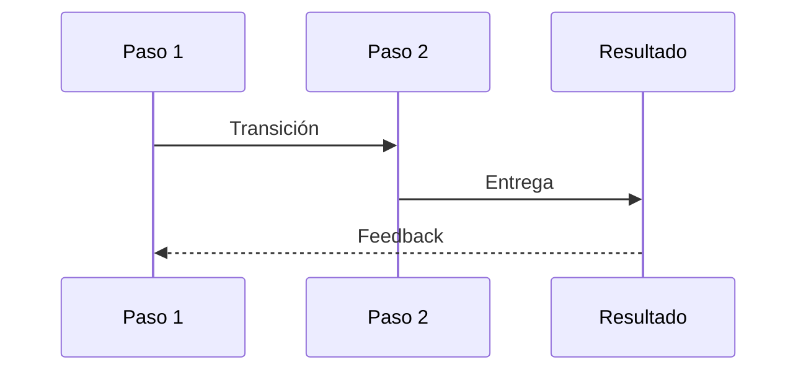
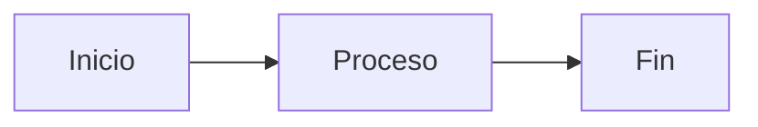

<SlidesViewer>

## A · Portada o Título Principal

::: accent-box 🎓 Patrón de Portada
**Ideal para el inicio de una presentación o una nueva sección.**

Este patrón utiliza el color de marca (brand) para centrar la atención del espectador en el título principal y subtítulo de la presentación.
:::

---

## B · Diapositiva de Objetivos

::: accent-box purple 🎯 Objetivos de esta sección
Utiliza este formato para listar los resultados de aprendizaje o las metas al comienzo de un tema.
:::

::: info-box Lo que aprenderemos

- ✓ Primer objetivo o meta a alcanzar.
- ✓ Segundo objetivo con un verbo de acción claro.
- ✓ Tercer punto destacando una habilidad que se adquirirá.
- ✓ Cuarto punto para establecer expectativas.
:::

---

## C · Definiciones Clave

> **Concepto principal:** Usa bloques de cita (`>`) para enmarcar definiciones formales, leyes o principios que los estudiantes deben memorizar o comprender profundamente.
>
> — *Fuente de la definición o glosario*

::: info-box Desglose del concepto

- **Elemento 1:** Primera parte que compone la definición.
- **Elemento 2:** Segunda parte importante a destacar.
- **Elemento 3:** Conclusión o resultado de la definición.
:::

---

## D · Introducción de un Concepto con Analogía


Este esquema de dos columnas es perfecto para introducir una idea. Muestra una imagen visual en un lado y texto explicativo en el otro. Utiliza analogías para facilitar la comprensión.

> "Una analogía ayuda a conectar algo nuevo con algo ya conocido."
>
> — *Técnica Pedagógica*

::: accent-box 💡 Mensaje Clave
Remata la diapositiva con la conclusión principal que el alumno debe retener sobre esta imagen y analogía.
:::

---

## E · Exposición de Filosofía o Reglas


Cuando necesites explicar las "reglas del juego", principios fundamentales o una filosofía de trabajo, este diseño ofrece un balance perfecto entre peso visual y texto con autoridad.

> Destaca aquí el mantra, lema o principio inquebrantable de la lección.
>
> — *Autoridad en la materia*

::: accent-box success ✨ Implicación Práctica
Explica en esta caja cómo esa filosofía afecta directamente al trabajo o tareas del espectador en su día a día.
:::

---

## F · Enumeración de Herramientas o Pasos


Ideal para presentar una lista estructurada, como una caja de herramientas, requisitos previos o pasos iniciales:

- **Elemento A:** Breve descripción de su propósito.
- **Elemento B:** Por qué es necesario tenerlo.
- **Elemento C:** Cuándo se debe utilizar.

::: tip-box Consejo de uso (`tip-box`)
Añade aquí una recomendación profesional o un atajo ("tip") que los expertos utilizan respecto a la lista superior.
:::

---

## G · Requisitos e Información Técnica


::: info-box Contexto o Requisitos (`info-box`)

- Primer requisito indispensable para continuar.
- Segundo aspecto técnico a tener en cuenta.
- Tercer dato informativo crucial.
:::

::: tip-box Sugerencia o Mejora
Este patrón de doble caja (Info + Tip) con imagen es excelente para separar lo obligatorio (arriba) de lo recomendado (abajo).
:::

---

## H · Impacto o Resultado Esperado


> Utiliza este espacio para mostrar la trascendencia del tema analizado. ¿Por qué importa lo que estamos estudiando?
>
> — *Justificación del tema*

::: accent-box success ✨ Dato Cuantitativo o Éxito
Destaca aquí una métrica, porcentaje o beneficio final. Por ejemplo: "El uso de esta técnica mejora la retención un 40%".
:::

---

## H2 · Exposición Lineal con Imagen Centrada


::: info-box Patrón de lectura enfocada
Este diseño, con la etiqueta `#center` en la imagen, rompe las columnas para forzar un flujo vertical de lectura (Imagen panorámica -> Texto explicativo debajo). Perfecto para visuales panorámicos o capturas de interfaz amplias.
:::

---

## I · Explicación de Código o Proceso Secuencial

Usa esta diapositiva (sin imagen, para maximizar espacio) cuando necesites mostrar un bloque de código, un algoritmo o una receta textual.

```text
Paso 1: Inicialización del entorno
Paso 2: Procesamiento de los datos de entrada
Paso 3: Generación del resultado esperado
```

::: info-box Explicación paso a paso

- Línea 1: Qué está ocurriendo al principio.
- Línea 2: Explicación de la transformación o núcleo.
- Línea 3: Significado del output entregado.
:::

---

## J · Teoría Profunda (Sin distracciones)

> Cuando el texto es denso y requiere máxima concentración, omite las imágenes. Usa una cita central para el postulado teórico principal que fundamenta toda la lección.

::: accent-box teal 💡 Ley o Regla de Oro
Establece aquí los límites o la regla absoluta que gobierna la teoría expuesta arriba.
:::

::: info-box Explicación detallada
Añade los matices, excepciones o el contexto histórico que ayuda a entender de dónde proviene esa regla.
:::

---

## K · Resaltar un Argumento de Autoridad


Este patrón minimalista es ideal para hacer una pausa, invitar a la reflexión o lanzar una pregunta retórica a la audiencia.

> Presenta una idea disruptiva o contra-intuitiva que rete las percepciones iniciales.
>
> — *Reflexión Docente*

::: accent-box ✦ El Contraste
Refuerza en esta caja la respuesta a esa reflexión, creando un momento "Aha!" o de revelación con el color de marca.
:::

---

## L · Histórico, Cronograma o Evolución


::: info-box El Pasado
Describe aquí cómo se hacían las cosas antes o cuál era el problema original que motivó un cambio.
:::

> Muestra el punto de inflexión. El momento en el que el paradigma cambió o la tecnología evolucionó.
>
> — *Hito de cambio*

::: accent-box success ✨ El Presente / Futuro
Enumera las ventajas actuales o los nuevos comandos/herramientas disponibles tras esa evolución.
:::

---

## M · Diagramas o Flujos Visuales

Este modelo a pantalla completa es para flujos de proceso o arquitecturas complejas utilizando diagramas.

<div v-pre>



</div>

::: note-box Nota aclaratoria (`note-box`)
Acompaña el diagrama grande con una nota pequeña al pie que explique cómo leer el diagrama o a qué proceso específico pertenece.
:::

---

## N · Comparación: Antes vs Después (Malo vs Bueno)

Excelente para contrastar dos formas de hacer las cosas utilizando viñetas o bloques de código en pestañas.

::: tabs

== ❌ Metodología Incorrecta

```text
1. Hacer todo manualmente.
2. Cometer errores humanos.
3. Invertir demasiado tiempo.
```

Texto explicativo de por qué este enfoque es perjudicial, frágil o está obsoleto.

== ✅ Buena Práctica Recomendada

```text
1. Automatizar el proceso base.
2. Validar con herramientas seguras.
3. Obtener resultados consistentes y rápidos.
```

Explicación de por qué este es el estándar actual y qué beneficios inmediatos aporta.

:::

---

## O · Clasificación o Tipologías Múltiples

Cuando un concepto se divide en tres o más tipos, las pestañas son la mejor forma de organizar el contenido sin saturar la diapositiva.

::: tabs

== Tipo A

Descripción de la primera variante. Sus características principales y su caso de uso ideal.

```text
Ejemplo práctico del Tipo A
```

== Tipo B

Descripción de la segunda variante. En qué se diferencia de la primera.

```text
Ejemplo práctico del Tipo B
```

== Tipo C

Tercera variante o caso excepcional. Ideal para usos avanzados.

```text
Ejemplo práctico del Tipo C
```

:::

---

## P · Restricciones o Barreras


> Utiliza este diseño para hablar de qué **NO** se debe hacer, los límites del sistema, o validaciones y requisitos estrictos.

::: info-box Checklist de Seguridad / Restricciones

- `Restricción 1` — Criterio que no se puede saltar.
- `Restricción 2` — Límite de capacidad o de tiempo.
- `Restricción 3` — Consecuencia si se evade la norma.
:::

---

## Q · Las Tres Advertencias (Apiladas)

Patrón sin imagen, compuesto por bloques de colores de menor a mayor severidad. Útil para protocolos de prevención de errores.

::: accent-box info 📋 Contexto del Problema
Presenta la situación donde el alumno debe tener especial cuidado.
:::

::: info-box Práctica Estándar
Qué se aconseja hacer en condiciones normales de funcionamiento.
:::

::: warning-box Cuidado / Precaución (`warning-box`)
Posibles fallos comunes si no se presta atención. Situaciones que degradan la experiencia.
:::

::: danger-box Peligro Crítico (`danger-box`)
Errores fatales, pérdida de datos o prácticas que invalidan todo el trabajo realizado. ¡Evitar siempre!
:::

---

## R · Diagrama + Texto Descriptivo en Pestañas

Cuando tienes un diagrama pero también necesitas aportar mucho texto explicativo, sepáralos en pestañas para no abrumar.

::: tabs

== El Diagrama

<div v-pre>



</div>

== Resumen Secuencial

**Explicación fase por fase del esquema anterior:**

1. Explicación detallada del nodo Inicio.
2. Descripción de lo que ocurre dentro de la caja de Proceso.
3. Cómo se interpreta el Fin o resultado obtenido.
4. Notas sobre las flechas o transiciones entre cajas.

:::

---

## S · Comparativa Warning vs Info

Ideal para diferenciar claramente la "Teoría general" de la "Advertencia particular" usando bloques contrapuestos.

::: warning-box Lo que requiere atención especial
Enfoca este bloque en aquello que confunde al 90% de los estudiantes. Ayúdales a prevenir el error antes de que ocurra.

```text
Aviso visual del posible error
```

:::

::: info-box La norma subyacente
Explica la regla que justifica la advertencia de arriba para construir un conocimiento razonado, no solo memorizado.

```text
El estándar que debemos seguir
```

:::

---

## T · Reglas Estrictas o Protocolos Vitales

> Para transmitir que un fallo en este punto es inaceptable. El bloque de cita establece la regla incuestionable del tema a tratar.
>
> — *Manual de Estándares*

::: accent-box danger ⛔ El Blindaje
Explica las medidas proactivas que debe tomar el alumno para cumplir la norma superior.
:::

::: note-box Nota al margen (`note-box`)
Excepciones (si las hay) a esta directiva, o aclaraciones de bajo nivel para los más curiosos.
:::

---

## U · Ejercicio Práctico o Propuesta de Trabajo

Presenta una tarea, ejercicio o reto para que los alumnos apliquen lo aprendido.

```text
Enunciado del Ejercicio:
1. Crea un elemento nuevo.
2. Aplícale estas 3 transformaciones.
3. Valida que cumple con la regla X y la restricción Y.
```

::: accent-box teal 💡 Pistas y Orientación
Ofrece un punto de apoyo metodológico: "Recuerda separar cada paso antes de intentar resolver todo de golpe."
:::

::: note-box Criterio de Evaluación
Explica cómo sabrá el alumno si ha superado el ejercicio correctamente (ej. "Si el sistema no devuelve advertencias, lo has logrado").
:::

---

## V · Resumen de la Sesión

::: accent-box purple 📝 Recapitulando lo aprendido (Cierre)
Esta es la diapositiva de síntesis obligatoria al final de un capítulo. Reúne todo en un esquema mental ágil.
:::

::: info-box Conceptos que te debes llevar

- → **Punto 1:** Resumen en una línea del bloque A.
- → **Punto 2:** Resumen en una línea del bloque B.
- → **Punto 3:** Resumen en una línea del bloque C.
- → **Punto 4:** La moraleja o consejo final a recordar.
:::

---

## W · Despedida, Cierre y Pasos Siguientes

::: accent-box 🎓 Fin del Módulo / Sesión
**¿Qué hacer a partir de ahora?**

Próximos pasos recomendados · Repasar el glosario main

Actividades complementarias · Realizar la práctica autónoma 1.0

Próxima lección · *Introducción al concepto de nivel 2*
:::

</SlidesViewer>
