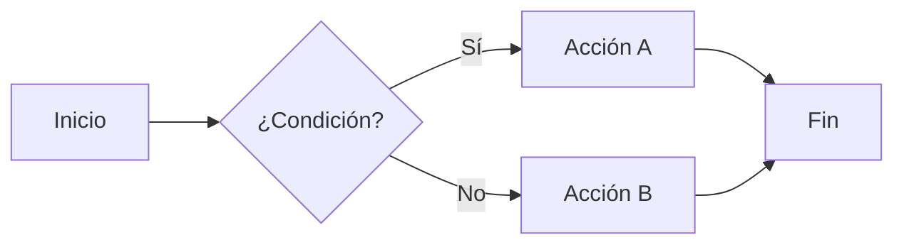
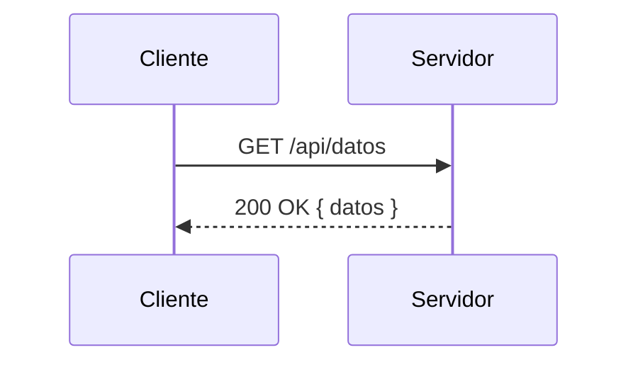
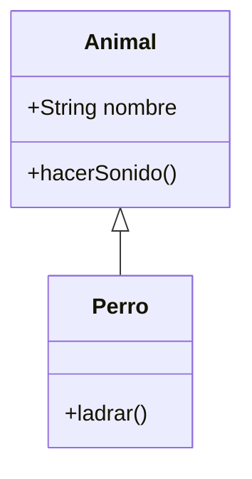
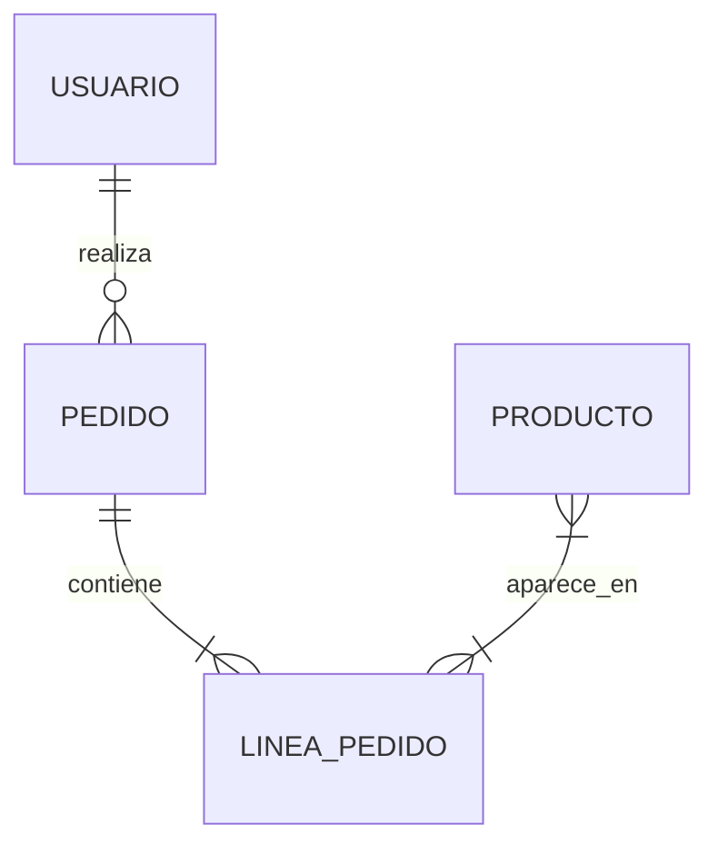

# 🧩 Catálogo de Componentes

Todos los bloques y componentes disponibles en EduPress. Todo se escribe en Markdown puro — no necesitas HTML ni Vue.

---

## Contenedores nativos de VitePress

Los contenedores de VitePress se usan con `:::` seguido del tipo:

| Tipo | Sintaxis | Uso |
|------|----------|-----|
| Información | `::: info Título` | Notas generales y contexto |
| Consejo | `::: tip Título` | Buenas prácticas, consejos |
| Aviso | `::: warning Título` | Advertencias importantes |
| Peligro | `::: danger Título` | Errores críticos o prohibiciones |
| Detalles | `::: details Título` | Contenido colapsable |

```md
::: info Nota sobre el entorno
Este paso requiere Node.js 16 o superior.
:::

::: tip Buena práctica
Usa nombres de archivo descriptivos con prefijo numérico.
:::

::: warning Atención
El valor de `basePath` debe coincidir con el repositorio.
:::

::: danger Error crítico
No ejecutes `rm -rf` en producción sin backup.
:::

::: details Ver solución
La solución es instalar las dependencias con `npm install`.
:::
```

---

## Cajas personalizadas (InfoBox)

Las cajas `info-box`, `tip-box`, `warning-box` y `danger-box` son versiones estilizadas con gradiente que incluyen un ícono automático.

| Bloque | Sintaxis | Color |
|--------|----------|-------|
| `info-box` | `::: info-box Título` | Azul |
| `tip-box` | `::: tip-box Título` | Verde |
| `warning-box` | `::: warning-box Título` | Amarillo |
| `danger-box` | `::: danger-box Título` | Rojo |

```md
::: info-box ¿Sabes que...?
Las cajas info-box soportan **Markdown** dentro: listas, código y tablas.
:::

::: tip-box Consejo del día
Guarda tu trabajo frecuentemente para no perder cambios.
:::

::: warning-box Cuidado
Cambiar `basePath` sin actualizar el repositorio causará errores 404.
:::

::: danger-box Error irrecuperable
Eliminar la carpeta `node_modules` en producción detiene el servidor.
:::
```

---

## Cajas NoteBox

La `note-box` es una variante neutral para notas técnicas o apuntes informales:

```md
::: note-box Apunte técnico
Esta función recibe un string y devuelve un booleano.
:::
```

---

## AccentBox — Caja con gradiente

La `accent-box` muestra un bloque con fondo de gradiente intenso. Se usa principalmente en diapositivas para destacar definiciones, conceptos clave o mensajes de apoyo.

**Sintaxis:**

```md
::: accent-box [gradiente] Título
Contenido
:::
```

**Gradientes disponibles:**

| Valor | Color | Uso sugerido |
|-------|-------|-------------|
| *(sin valor)* / `primary` | Brand color (coral) | Concepto clave |
| `success` | Verde | Ventajas, resultados positivos |
| `warning` | Naranja | Advertencias, puntos críticos |
| `danger` | Rojo | Errores, prohibiciones |
| `info` | Azul | Información general |
| `purple` | Púrpura | Definiciones formales |
| `orange` | Naranja-rosado | Énfasis decorativo |
| `teal` | Verde azulado | Trucos, consejos avanzados |

```md
::: accent-box 📖 Definición básica
Un array es una colección ordenada de elementos.
:::

::: accent-box success ✨ Ventaja principal
PHP procesa el HTML en el servidor — el cliente nunca ve el código fuente.
:::

::: accent-box purple 🎓 Concepto avanzado
El patrón MVC separa la lógica de negocio de la presentación.
:::

::: accent-box teal 💡 Regla de oro
Una función debe hacer una sola cosa y hacerla bien.
:::
```

::: tip accent-box en diapositivas
El uso más habitual de `accent-box` es dentro de `<SlidesViewer>` para crear slides con texto destacado sobre fondo de gradiente. Consulta la guía de [Diapositivas](./9-diapositivas).
:::

---

## Pestañas (tabs)

Organiza contenido alternativo en pestañas sin que ocupe doble espacio:

```md
::: tabs

== macOS / Linux
\```bash
npm install
./start-project.sh
\```

== Windows
\```cmd
npm install
npm run docs:dev
\```

== Docker
\```bash
docker compose up vitepress
\```

:::
```

::: info Instalación del plugin
Las pestañas requieren `vitepress-plugin-tabs`, que ya está incluido en la plantilla.
:::

---

## Diagramas Mermaid

EduPress incluye soporte completo de Mermaid con cambio automático entre modo claro y oscuro.

### Flowchart (diagrama de flujo)

````md

````

### Diagrama de secuencia

````md

````

### Diagrama de clases

````md

````

### Diagrama entidad-relación (ER)

````md

````

::: tip Mermaid y modo oscuro
Los diagramas se renderizan automáticamente con el tema correcto cuando el usuario cambia entre modo claro y oscuro. No necesitas ninguna configuración extra.
:::

---

## Imágenes

```md
<!-- Imagen básica -->


<!-- Imagen con caption (pie de foto) -->

*Pie de foto opcional centrado*
```

Para más detalles sobre rutas y formatos, consulta [Imágenes para Contenido](./11-imagenes).

---

## ThemedImage — Logos con modo claro/oscuro

Para imágenes que tienen versión diferente en modo claro y oscuro (como logos):

```md
<ThemedImage
  src="/img/logo.png"
  darkSrc="/img/logo-dark.png"
  alt="Logo del instituto"
  width="200"
/>
```

---

## SlidesViewer — Presentaciones

El componente de diapositivas se documented en detalle en [Crear Diapositivas](./9-diapositivas).

**Estructura básica:**

````md
<SlidesViewer>

# Título de la diapositiva 1

Contenido de la primera diapositiva.

---

# Título de la diapositiva 2

::: accent-box success ✨ Punto clave
Mensaje destacado en esta diapositiva.
:::

</SlidesViewer>
````

---

## ExportPDF — Exportación a PDF

El componente `<ExportPDF />` inserta un botón que permite a los estudiantes descargar la página actual en formato PDF. Incluye un algoritmo inteligente que evita cortar bloques importantes (tablas, código, avisos) entre páginas y aplica un modo de ahorro de tinta temporal durante la generación.

**Sintaxis:**

```md
<ExportPDF />

# Título de mi tema
Contenido de los apuntes...
```

::: tip Configuración del Exportador
El comportamiento del PDF se configura en `src/.vitepress/config/project.ts` con la variable `pdfExportMode`. Puedes elegir entre `'image'` (alta fidelidad visual con el sistema inteligente) o `'text'` (diálogo nativo de impresión del navegador).
:::

---

**Siguiente paso:** [Crear Diapositivas →](./9-diapositivas)
